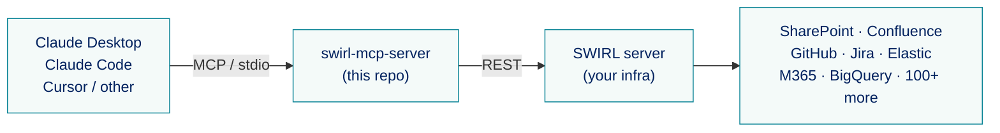
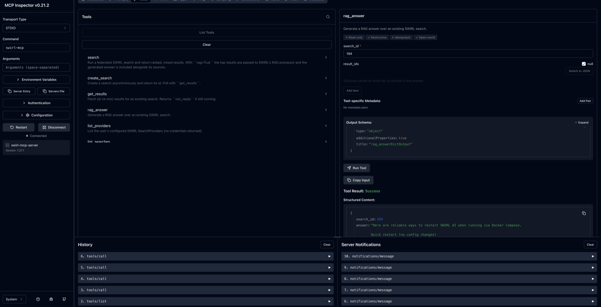

<div align="center">

[](https://www.swirlaiconnect.com)

# SWIRL MCP Server

### Give Claude (and any MCP client) instant federated search and RAG over 100+ enterprise sources — without moving your data.

[⚡ Quickstart](#-quickstart) ·
[🛠️ Tools](#%EF%B8%8F-tools) ·
[🔌 Connectors](https://swirlaiconnect.com/connectors) ·
[🤝 Contribute](#-contributing)

[](https://opensource.org/license/apache-2-0/)
[](https://www.python.org/downloads/)
[](https://modelcontextprotocol.io)
[](https://github.com/swirlai/swirl-search)
[](https://www.swirlaiconnect.com)

[](https://github.com/swirlai/swirl-mcp-server/actions/workflows/ci.yml)
[](https://github.com/swirlai/swirl-mcp-server/stargazers)
[](https://github.com/swirlai/swirl-mcp-server/commits/main)
[](https://github.com/swirlai/swirl-mcp-server/issues)

</div>

---

**Contents:** [🤔 Why](#-why) · [💡 What can you build](#-what-can-you-build-with-swirl-mcp) · [👀 See it in action](#-see-it-in-action) · [⚡ Quickstart](#-quickstart) · [🩺 Troubleshooting](#-troubleshooting) · [🛠️ Tools](#%EF%B8%8F-tools) · [📚 Resources & prompts](#-resources--prompts) · [⚙️ Configuration](#%EF%B8%8F-configuration) · [🧪 Development](#-development) · [🔧 How it works](#-how-it-works) · [🤝 Contributing](#-contributing) · [🆘 Need help?](#-need-help) · [📜 License](#-license)

---

`swirl-mcp-server` is a [Model Context Protocol](https://modelcontextprotocol.io) adapter for [SWIRL](https://github.com/swirlai/swirl-search). It exposes SWIRL's federated search and RAG capabilities as MCP tools, so Claude Desktop, Claude Code, Cursor, and other MCP clients can answer questions against your private data sources — SharePoint, Confluence, GitHub, Jira, Elastic, BigQuery, Snowflake, MongoDB, M365, and 100+ more — without any of it leaving your network.



## 🤔 Why

- **Search where your data lives.** SWIRL queries each connector in parallel, federates the results, and re-ranks them with cosine relevancy — no vector DB, no ETL, no data movement.
- **One tool call, one answer.** `search(query="...", rag=true)` returns a generated answer with sources. The model never has to orchestrate per-source plumbing.
- **Permission-aware.** SWIRL enforces per-user ACLs on every search and result. The MCP server forwards the user's credentials and never widens that scope.
- **Drop-in.** No changes to your SWIRL deployment. The server speaks SWIRL's existing REST API.

## 💡 What Can You Build With SWIRL MCP?

Real workflows that snap into place once Claude can call `search`:

### 🔍 Ask Claude about your company's knowledge

- Point Claude Desktop at SharePoint, Confluence, OneDrive, and Notion via SWIRL.
- Ask "what did we decide about the Q3 pricing change?" — get a synthesized answer with links back to the source docs.
- No data leaves your network; results respect each user's existing permissions.

### 👩‍💻 Code with full project context

- Wire Claude Code into GitHub, Jira, and your internal docs in one tool call.
- "Why does service X retry on 503?" pulls in code, tickets, and runbooks together.
- Stop alt-tabbing between Jira and your editor while debugging.

### 🤖 Customer support copilot

- Ground replies in your real support docs and past tickets — not the model's training data.
- Maintain consistent answers across the team.
- Cite sources in every response so reps can verify before sending.

### 🏢 Enterprise unified search, conversationally

- One MCP server fans out to 100+ connectors.
- Same SWIRL deployment serves the Galaxy UI, REST APIs, *and* every MCP client on every desk.
- Add a new source once, and every assistant can search it.

## 👀 See it in action

`rag_answer` running against a local SWIRL via the MCP Inspector — a federated query answered with sources, ready to be piped into any MCP client:



## ⚡ Quickstart

### Prerequisites

- **Python 3.10+** on the machine that runs the MCP server.
- **A running SWIRL instance** — the upstream [Docker quickstart](https://github.com/swirlai/swirl-search#-try-swirl-now-in-docker) gets you one in 60 seconds.
- **For `rag=true` (generated answers):** SWIRL itself needs an OpenAI or Azure OpenAI key. Set `OPENAI_API_KEY` in the SWIRL environment *before* `docker compose up` — not on the MCP server. Without it, RAG calls return a "check credentials" message. Plain `search` works fine without a key.

| Component | Tested versions |
|---|---|
| Python | 3.10, 3.11, 3.12 |
| SWIRL Metasearch | 4.x (against `main` of [swirlai/swirl-search](https://github.com/swirlai/swirl-search)) |
| MCP Python SDK | 1.x |
| OS | macOS, Linux, Windows (WSL2) |

### 1. Run SWIRL

```bash
curl https://raw.githubusercontent.com/swirlai/swirl-search/main/docker-compose.yaml -o docker-compose.yaml
export OPENAI_API_KEY=<your-openai-or-azure-openai-key>   # optional, enables rag=true
docker compose pull && docker compose up
```

SWIRL will be at `http://localhost:8000`. The Docker image ships with `admin` / `password` as default dev credentials — change them for anything beyond local experimentation.

### 2. Install the MCP server

Until v0.1 lands on PyPI, install from GitHub:

```bash
pipx install git+https://github.com/swirlai/swirl-mcp-server
```

That puts `swirl-mcp` on your PATH. (Don't have pipx? `python -m pip install --user pipx && pipx ensurepath`.)

> Once published to PyPI, `uvx swirl-mcp-server` will be the zero-install one-liner.

### 3. Wire it into your MCP client

#### Claude Desktop

Edit `~/Library/Application Support/Claude/claude_desktop_config.json` (macOS) or `%APPDATA%\Claude\claude_desktop_config.json` (Windows):

```json
{
  "mcpServers": {
    "swirl": {
      "command": "swirl-mcp",
      "env": {
        "SWIRL_BASE_URL": "http://localhost:8000",
        "SWIRL_USERNAME": "<your-swirl-username>",
        "SWIRL_PASSWORD": "<your-swirl-password>"
      }
    }
  }
}
```

Restart Claude Desktop. You should see "swirl" in the tools menu. Try:

> Use the swirl search tool with rag=true to ask: what are the latest arxiv papers on retrieval-augmented generation?

#### Claude Code

```bash
claude mcp add swirl swirl-mcp \
  -e SWIRL_BASE_URL=http://localhost:8000 \
  -e SWIRL_USERNAME=<your-swirl-username> \
  -e SWIRL_PASSWORD=<your-swirl-password>
```

#### Cursor / other MCP clients

See `examples/` for ready-to-paste configs.

## 🩺 Troubleshooting

| Symptom | Cause | Fix |
|---|---|---|
| `rag_answer` returns *"check the OpenAI or Azure/OpenAI credentials in your environment"* | SWIRL has no `OPENAI_API_KEY` set | `export OPENAI_API_KEY=…` **before** `docker compose up`. The MCP server itself doesn't need the key — SWIRL does. |
| `SWIRL denied access. The user lacks permission for this operation.` on `rag_answer` or `search(rag=true)` | Running an old build that used Basic auth for `/sapi/` endpoints (SWIRL guards them with DRF Tokens). | Upgrade to v0.1+; the client now obtains a token automatically. |
| `command not found: swirl-mcp` after install | `pipx`'s bin dir isn't on `PATH` | `pipx ensurepath`, then restart the shell or your MCP client. |
| `Connection refused` / timeouts | SWIRL isn't running, or `SWIRL_BASE_URL` points somewhere else | `curl http://localhost:8000/` should return a redirect (302). If not, `docker compose up` first. |
| `get_results` returns `{"status": "not_ready"}` | Search is still being mixed by SWIRL | Not an error — wait ~1s and call again. The model can loop on this. |
| TLS errors against a self-signed SWIRL cert | Default is to verify TLS | Set `SWIRL_VERIFY_SSL=false` in the env block. Only do this for trusted internal hosts. |

## 🛠️ Tools

The server exposes six tools. The headline is `search` — the rest are escape hatches for async, discovery, and reuse.

| Tool | Purpose | Backend |
|---|---|---|
| `search` | One-shot federated search. Set `rag=true` for a generated answer with citations. | `GET /api/swirl/search/?qs=…` |
| `create_search` | Kick off a search asynchronously and get back a `search_id`. | `POST /api/swirl/search/` |
| `get_results` | Fetch (or re-mix) results for an existing `search_id`. Returns `not_ready` while running. | `GET /api/swirl/results/?search_id=…` |
| `rag_answer` | Generate a RAG answer over an existing search's results. | `GET /api/swirl/sapi/detail-search-rag/` |
| `list_providers` | List the user's configured SearchProviders (credentials stripped). | `GET /api/swirl/searchproviders/` |
| `list_searches` | List the user's recent searches. | `GET /api/swirl/search/` |

### `search` — the one you'll use 90% of the time

```jsonc
// input
{
  "query": "what's new in RAG?",
  "providers": ["arxiv", "europe_pmc"],   // optional — defaults from env
  "result_count": 10,
  "rag": true,                            // get a generated answer
  "explain": false                        // include relevancy explanations
}

// output (trimmed)
{
  "structured": {
    "search_id": 42,
    "query": "what's new in RAG?",
    "answer": "Recent work on retrieval-augmented generation…",
    "results": [
      {
        "title": "GraphRAG: …",
        "snippet": "We introduce…",
        "url": "https://arxiv.org/abs/…",
        "source": "Arxiv",
        "relevancy_score": 0.91,
        "date_published": "2025-04-01"
      }
    ]
  },
  "markdown": "## Answer\n…\n## Sources\n1. [GraphRAG: …](https://…) — _Arxiv · score 0.91 · 2025-04-01_\n   > We introduce…"
}
```

Returning both `structured` and `markdown` is intentional: MCP clients that render rich content show the markdown; ones that pass tool output back to the model verbatim get the leaner structured form.

## 📚 Resources & prompts

- **`swirl://providers`** — JSON catalog of active SearchProviders. Useful as pinned context in clients that support resource pinning.
- **`swirl_research(question)`** — a reusable prompt that instructs the model to call `search` with `rag=true` and cite each source.

## ⚙️ Configuration

All settings come from environment variables (prefixed `SWIRL_`). A `.env` file in the working directory is auto-loaded.

| Var | Required | Default | Notes |
|---|---|---|---|
| `SWIRL_BASE_URL` | yes | `http://localhost:8000` | Your SWIRL instance root. |
| `SWIRL_USERNAME` | yes | — | Basic auth user. |
| `SWIRL_PASSWORD` | yes | — | Basic auth password. |
| `SWIRL_VERIFY_SSL` | no | `true` | Set to `false` for self-signed certs. |
| `SWIRL_TIMEOUT_SECONDS` | no | `30` | HTTP timeout for normal calls. |
| `SWIRL_RAG_TIMEOUT_SECONDS` | no | `60` | Separate, larger timeout for the RAG endpoint. |
| `SWIRL_MAX_RESULTS` | no | `50` | Upper bound on `result_count` (caps LLM token cost). |
| `SWIRL_DEFAULT_PROVIDERS` | no | — | Comma-separated provider ids/names/tags applied when a caller omits `providers`. |

> 🔒 **Credentials are never logged or returned in tool output.** `list_providers` deliberately strips `credentials`, `url`, and `query_template` from its response.

### Transports

```bash
# stdio (default — what desktop clients use)
swirl-mcp

# streamable HTTP — for shared / hosted deployments
swirl-mcp --transport http --host 0.0.0.0 --port 8765
```

In HTTP mode, multi-tenant deployments should put an auth proxy in front and forward the per-user SWIRL credentials.

## 🧪 Development

```bash
git clone https://github.com/swirlai/swirl-mcp-server
cd swirl-mcp-server
python -m venv .venv && source .venv/bin/activate
pip install -e ".[dev]"

pytest           # run tests (HTTP mocked, no SWIRL required)
ruff check src tests
```

### Testing against a real SWIRL

```bash
export SWIRL_BASE_URL=http://localhost:8000
export SWIRL_USERNAME=<your-swirl-username>
export SWIRL_PASSWORD=<your-swirl-password>
swirl-mcp -v
```

Then point any MCP client at the command, or use the [MCP Inspector](https://github.com/modelcontextprotocol/inspector):

```bash
npx @modelcontextprotocol/inspector swirl-mcp
```

## 🔧 How it works

`swirl-mcp-server` is a thin async adapter. There's no business logic on top of SWIRL — the server reshapes SWIRL's REST envelopes into a lean, LLM-friendly form and surfaces them as MCP tools.

```
src/swirl_mcp/
├── config.py       # pydantic-settings env loader
├── client.py       # async httpx wrapper around SWIRL's REST API
├── formatting.py   # SWIRL result envelopes → trimmed, normalized payloads
├── models.py       # pydantic schemas for tool inputs/outputs
└── server.py       # FastMCP entrypoint + tool/resource/prompt registrations
```

A few intentional design choices:

- **Snippets are truncated to 600 chars per result.** Stops a chatty connector from dumping a whole article into the model's context.
- **`get_results` returns `{status: "not_ready"}`, not an error, when SWIRL is still running.** Lets the model poll cleanly.
- **No admin tools.** Creating/editing/deleting `SearchProvider`s, users, query transforms, etc. stays in the SWIRL UI. They're high blast radius and rarely what an assistant should be doing autonomously.
- **`search` is synchronous.** SWIRL's `?qs=` endpoint blocks until results are mixed — fine for tool calls. Use `create_search` + `get_results` when you need async (subscribe mode, slow connectors).

## 🤝 Contributing

PRs welcome! Please:
- Run `pytest` and `ruff check` before pushing.
- Add a test for any new tool or behavior.
- Keep the dependency footprint small — this is a thin adapter, not a framework.

## 🆘 Need help?

- **Issues with this MCP server:** open a [GitHub issue](https://github.com/swirlai/swirl-mcp-server/issues) — bug reports, feature ideas, and "this doc is confusing" all welcome.
- **Questions about SWIRL itself, or requesting a new connector:** email the SWIRL team at [support@swirlaiconnect.com](mailto:support@swirlaiconnect.com).
- **Want SWIRL Enterprise** (managed deployment, premium connectors, SSO, support SLAs)? [Schedule a free 30-day demo](https://swirlaiconnect.com/contact-us).

## 📜 License

Apache 2.0 — see [LICENSE](LICENSE) and [NOTICE](NOTICE).

This project targets the open-source [SWIRL Metasearch](https://github.com/swirlai/swirl-search) project, which is also Apache 2.0 licensed.
